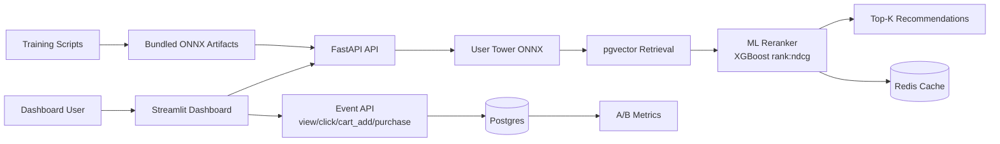

# Retail Optimization and Personalization Engine

[](https://fastapi.tiangolo.com/)
[](https://onnx.ai/)
[](https://www.docker.com/)
[](https://redis.io/)

Relevance-first recommendation system built on Instacart basket data, with live event feedback, static model serving, and a Streamlit demo UI.

## 2-Minute Story

1. Base behavior data comes from Instacart orders.
2. A two-tower retriever creates a candidate set quickly.
3. A feature-rich ML reranker scores candidates using user-product frequency, recency, reorder ratio, embedding similarity, and category affinity.
4. Business signals (margin and inventory) are secondary boosts, not primary rank drivers.
5. Streamlit dashboard logs view, click, cart_add, and purchase events.
6. Those events feed A/B metrics.
7. The backend serves bundled ONNX artifacts and a static recommendation stack.

## What Is Real vs Simulated

- Real:
	- Event logging pipeline (view/click/cart_add/purchase)
	- Retrieval and reranking inference
	- Redis caching for embeddings and assignment state
	- API latency monitoring
	- Static ONNX model loading
- Simulated:
	- Margin/inventory business features and their scale
	- Traffic scale assumptions
	- Some pricing/economic signals used for portfolio demonstration

## Architecture



## Ranking Approach

- Retrieval stage: Two-tower embeddings retrieve top-N nearest products.
- Reranking stage: XGBoost ranker optimized with ranking objective (`rank:ndcg`) and grouped user lists.
- Relevance features:
	- user_product_frequency
	- user_product_recency
	- user_product_reorder_ratio
	- embedding_similarity
	- category_affinity
- Business controls:
	- margin and inventory are low-weight boosts.
	- default group weights prioritize relevance:
		- control: relevance 0.92, margin 0.05, inventory 0.03
		- margin_boost: relevance 0.86, margin 0.10, inventory 0.04

## Offline Credibility Metrics

Run staged offline evaluation:

```bash
python training/offline_eval.py
```

Outputs three comparable blocks:

- retrieval_only
- retrieval_plus_heuristic_rerank
- retrieval_plus_ml_rerank

Metrics written to:

- logs/offline_ranking_metrics.json

## Demo Flow

1. Open dashboard.
2. Generate recommendations for a user.
3. Trigger product events in order: view -> click -> cart_add -> purchase.
4. Refresh recommendations.
5. Open experiment analytics for CTR, click-to-cart, and conversion.
6. Verify recommendation latency and event logging in the dashboard.

## Deployment

The backend is deployed on Render, the database is Neon Postgres, and Redis is Upstash.

- Backend: Render
- Database: Neon Postgres
- Cache: Upstash Redis
- Frontend: Streamlit Cloud

The backend reads `DATABASE_URL` from Neon and `REDIS_URL` from Upstash directly through environment variables.

## Tooling: One-Line Purpose

- FastAPI: low-latency async inference and event APIs.
- PostgreSQL + pgvector: vector retrieval and event persistence.
- Redis: cache embeddings and stable A/B assignment.
- XGBoost: fast interpretable reranking model.
- ONNX Runtime: efficient serving for embedding/rerank models.
- Streamlit: demo/control UI for interactions and monitoring.

## Quick Start

1. Install dependencies.

```bash
pip install -r requirements.txt
```

2. Configure environment.

```bash
cp .env.example .env
```

Set these values before starting the backend:

- `DATABASE_URL` for Neon
- `REDIS_URL` for Upstash
- `SECRET_KEY` for JWT auth

3. Start services.

```bash
docker compose -f deployments/docker-compose.yml up --build
```

4. Open:

- API docs: http://localhost:8000/docs
- Dashboard: http://localhost:8501

## Project Layout

```text
src/api         FastAPI routes and middleware
src/engine      Retrieval, reranking, session policy
training        Retrieval/reranker training and offline eval scripts
models          ONNX, reranker bundles, static artifacts
src/frontend    Streamlit dashboard and demo controls
```